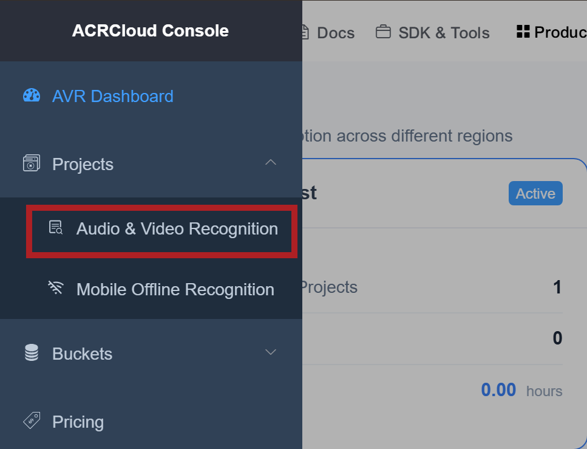
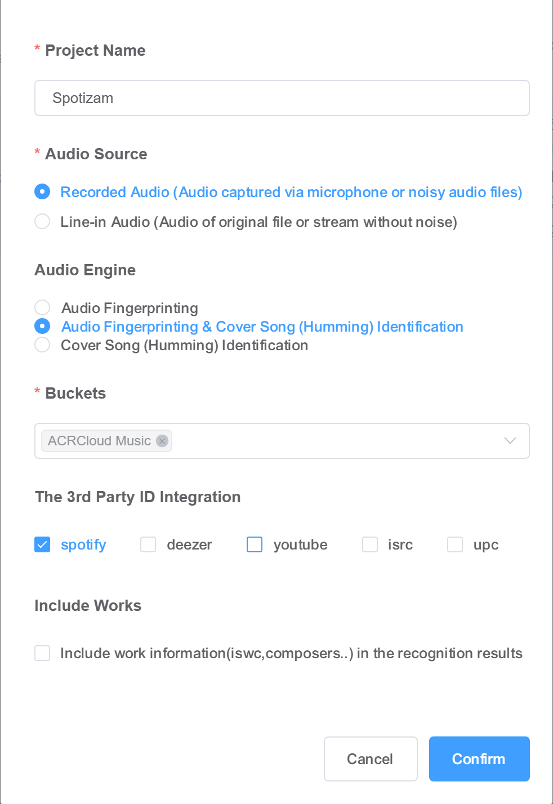

# Spotizam

`Spotizam` is a Spicetify extension that works like a lightweight shazam button inside Spotify.

It adds:

- a microphone button in Spotify's top bar
- a settings gear next to it
- support for `ACRCloud` and `AudD`
- optional audio saving
- post-match actions such as opening the song page or starting playback

## What It Does

When you click the mic button, Spotizam records a short sample from your microphone and sends it to the recognition provider you selected in settings.

If the provider finds a match, Spotizam can:

- open the matched song inside Spotify
- start playing the matched song
- do both

If the provider gives Spotizam a Spotify track ID directly, Spotizam uses that first. If not, it tries to resolve the result through Spotify search.

## Supported Providers

### ACRCloud (Recommended)

- Best option if you want support for both real audio and humming
- Default provider in Spotizam
- Requires:
  - `Host`
  - `Access Key`
  - `Access Secret`
- Signup:
  - <https://console.acrcloud.com/>

Notes:

- You choose any project/region inside ACRCloud after signup.
- See full setup guide [here](#acrcloud-setup-guide)

### AudD

- Easy to set up
- Good when you are playing the real audio
- Usually worse than ACRCloud for humming
- Requires:
  - `API Token`
- Signup:
  - <https://audd.io>
  - Go to your dashboard and get Your api_token

## Installation

### Option A - Installer Script (Recommended)
Installation
Clone the repository and navigate to the directory

```bash
git clone https://github.com/TechedWind707/spotizam
cd spotizam
```

On Windows
Run the install script (Powershell):
```powershell
install.ps1
```
On macOS/ Linux/ Windows using Git Bash
Run the install script
```bash
bash install.sh
```
What the script does:

- copy `spotizam.js` into Spicetify's `Extensions` folder
- register `spotizam.js` in Spicetify config
- if Spotify is closed: run `spicetify apply`
- if Spotify is open: ask you to close Spotify and re-run the script

Note
If you run `install.sh` in wsl, it will only copy `spotizam.js` into Spicetify `Extensions` folder,
You'll still need to register `spotizam.js` in Spicetify config and apply it by running these on Powershell/ Git Bash

```bash
spicetify config extensions spotizam.js
spicetify apply
```
### Option B - Manual Setup

1. Put [spotizam.js](./spotizam.js) in your Spicetify `Extensions` folder.
   Note:
   This folder is usually something like `%APPDATA%\spicetify\Extensions`
   which commonly expands to a path like `C:\Users\your-name\AppData\Roaming\spicetify\Extensions`.
2. Open a terminal.
3. Run:

```bash
spicetify config extensions spotizam.js
```
4. Close Spotify
5. Run:

```bash
spicetify apply
```
4. Restart Spotify.
5. If the button does not appear immediately, do a hard refresh inside Spotify with `Ctrl+Shift+R`.
6. The first time you use the mic, Spotify will ask for microphone permission.
7. If you enable audio saving or json saving and choose a folder, Spotify or the browser runtime may also ask for folder access permission.

## Where Settings Are Stored

Spotizam stores its settings in browser storage under:

```text
localStorage["spotizam_config"]
```

The saved shape looks like this:

```json
{
  "provider": "acrcloud",
  "recordingSeconds": 15,
  "afterMatch": {
    "openSong": true,
    "playSong": false
  },
  "history": {
    "enabled": false,
    "limit": 5,
    "includeAllMatches": false
  },
  "debug": {
    "keepAudio": false,
    "audioDirectory": "",
    "keepJson": false,
    "jsonDirectory": ""
  },
  "acrcloud": {
    "host": "",
    "accessKey": "",
    "accessSecret": ""
  },
  "audd": {
    "apiToken": ""
  }
}
```

## How To Use It

1. Click the gear icon next to the mic.
2. Choose your provider.
3. Enter the credentials for that provider.
4. Pick how long recordings should be.
5. Choose what should happen after a match.
6. Click `Save`.
7. Click the mic to identify a song or hum a melody.

## Settings Explained

### Recognition Provider

Choose one of:

- `ACRCloud`
- `AudD`

Only the selected provider is used when you click the mic.

### Recording Length

Allowed range:

- minimum: `15` seconds
- maximum: `30` seconds

Behavior:

- Spotizam always records at least `15` seconds
- if your limit is above `15`, you can click the mic again after `15` seconds to stop early

### After Match

Options:

- `Open song page`
- `Start playing immediately`
- `Both`

Behavior:

- checking `Both` automatically checks the other two boxes
- unchecking either of the other two automatically unchecks `Both`
- if Spotizam can resolve the Spotify track, it tries to open the song in Spotify directly

### Debug Audio

`Keep copy of recorded audio`

- Saves the exact audio blob that is about to be sent to the recognition provider
- Useful when you want to listen to what the provider actually received

`Choose Folder`

- Lets you pick a folder for debug audio in the current Spotify session
- Spotify may ask for folder permission when you do this
- If folder-picking is unavailable in the current Spotify runtime, Spotizam falls back to a normal browser download

### Debug JSON

`Keep copy of returned JSON`

- Saves the raw provider response payload (`ACRCloud` or `AudD`) for each recognition request
- Useful when debugging parsing/matching behavior

`Choose Folder`

- Lets you pick a folder for debug JSON in the current Spotify session
- If folder-picking is unavailable in the current runtime, Spotizam falls back to a normal browser download

### History

Advanced settings include a history feature for recent matches.

Options:

- `Enable history`
- `Max items (1-10)`
- `Include all matches from provider response`

Behavior:

- when disabled, no new history entries are recorded
- when enabled, Spotizam keeps the latest entries up to the selected limit
- `Include all matches` stores all candidates returned by the provider, not only the best match

## Button States

### Idle

- Mic icon is visible

### Recording

- Mic glows red
- before `15` seconds, clicking again does not stop recording
- after `15` seconds, clicking again stops early

### Processing

- Spinner appears
- Tooltip shows which provider is being used

### Match

- Green check icon

### Error

- Red X icon

## Debug Logging

Spotizam intentionally logs useful information to the browser console.

Examples:

- extension load
- settings save
- recording start / stop
- provider request start
- raw provider response payload
- whether a Spotify URI came from the provider directly or from fallback search
- after-match behavior decisions

These logs are helpful for troubleshooting.

## Provider Notes

### ACRCloud

Spotizam supports ACRCloud's normal music matches and humming matches.

If ACRCloud returns Spotify metadata, Spotizam uses the returned track ID directly.

### AudD

AudD uploads are sent as multipart form data using the `file` field.

## Troubleshooting

### The mic or gear icon is missing

Try:

```text
Ctrl+Shift+R
```

inside Spotify.

Spotify sometimes keeps stale page state around until a hard refresh.

If the last page open before you closed Spotify was any other page apart from the homepage, Spotizam can sometimes reattach to that page header instead of the normal `Your Library` area after startup.

This should not happen but if it does the easiest fix is:

1. Go back to Spotify's normal home/library area.
2. Press `Ctrl+Shift+R`.

That usually resets the page state and makes the mic and gear return to the expected library header area.

### A provider says there was no match

Check:

- whether your mic recording is clear enough
- whether the selected provider is the one you intended to use
- whether the provider returned a Spotify ID in the console logs

### ACRCloud says `invalid signature`

Double-check:

- `Host`
- `Access Key`
- `Access Secret`

Make sure they all belong to the same ACRCloud project and region.

### Audio recording or Response JSON does not save into the chosen folder

Folder handles are permission-based and session-based.

That means:

- you may need to choose the folder again after restarting Spotify
- some Spotify builds may only allow download fallback

## Development Notes

Spotizam is intentionally a single plain JavaScript file:

- no bundler
- no `import`
- no `require`
- plain DOM APIs only
- all UI styles are injected with a `<style>` tag

This keeps it easy to drop into a normal Spicetify setup.

## ACRCloud Setup Guide

Spotizam uses your own ACRCloud project. Setting it up usually takes only a few minutes.

### Step 1 - Create an ACRCloud account

1. Go to <https://console.acrcloud.com>
2. Click `Sign Up`
3. Register with your email
4. Verify your email and log in
5. After login, you will land on the ACRCloud dashboard

Notes:

- ACRCloud usually starts with a trial period first
- after the trial, ACRCloud is billed separately according to its current pricing
- check the live pricing page in your ACRCloud console before you publish or share setup instructions
- you may need billing details to keep using the service after the trial ends

### Step 2 - Create your project

1. On the dashboard you see a menu that has two parts: Programming Skills Required and Programming Skills Not Required.
Under Programming Skills Required, Click the Audio and Video Recognition link

2. In the left sidebar, open `Projects`
3. Choose `Audio & Video Recognition`

4. Click `Create Project`

5. Fill in the project like this:

| Setting | Recommended value |
|---|---|
| `Project Name` | Anything you like, for example `Spotizam` |
| `Audio Source` | `Recorded Audio` |
| `Audio Engine` | `Audio Fingerprinting & Cover Song (Humming) Identification` |
| `Buckets` | `ACRCloud Music` |
| `3rd Party ID Integration` | `Enable Spotify` |



Notes:
- The Audio Fingerprinting & Cover Song (Humming) Identification option is the important part if you want both real audio and humming support
- Spotify integration is the one Spotizam cares about most because it lets matches resolve into Spotify tracks more directly
- You can enable other third-party integrations too if you want them for your own ACRCloud usage

### Step 3 - Copy your credentials

After the project is created, copy these three values:

- `Host`
- `Access Key`
- `Secret Key`

They usually look like:

- Host: `identify-eu-west-1.acrcloud.com`
- Access Key: long alphanumeric string
- Secret Key: long alphanumeric string

Important:

- all three values must come from the same ACRCloud project
- if you mix credentials from different projects or regions, ACRCloud will reject the request with `invalid signature`

### Step 4 - Paste them into Spotizam

1. Open Spotify with Spicetify enabled
2. Click the Spotizam gear icon
3. Make sure `ACRCloud` is selected as the provider
4. Paste:
   - `Host`
   - `Access Key`
   - `Secret Key`
5. Click `Save`

### Step 5 - Test it

1. Play a song out loud near your microphone, or hum a tune
2. Click the mic button
3. Accept microphone permission if Spotify asks
4. Wait for the match result

If you enabled audio or json saving:

- choose a folder when prompted
- accept folder access permission if Spotify asks
- Spotizam will save the exact recorded audio blob it sends to ACRCloud or JSON returned from your recognition service